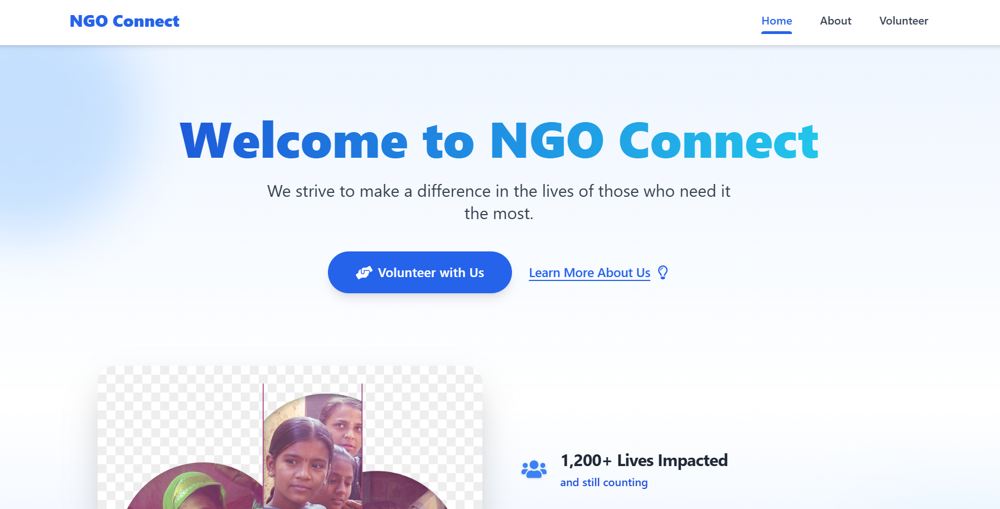
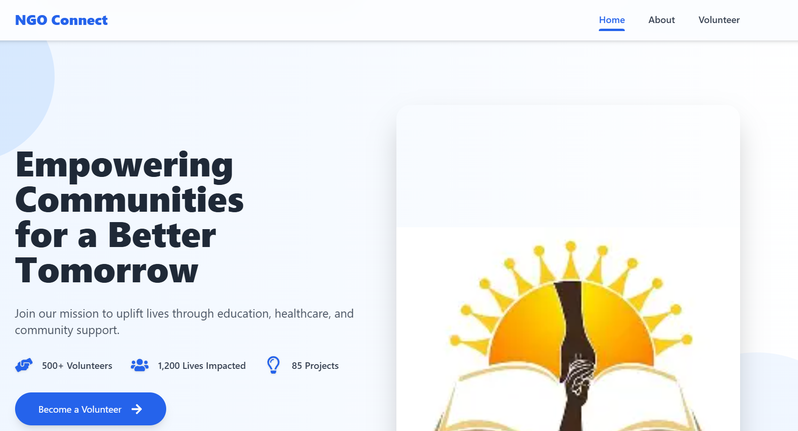
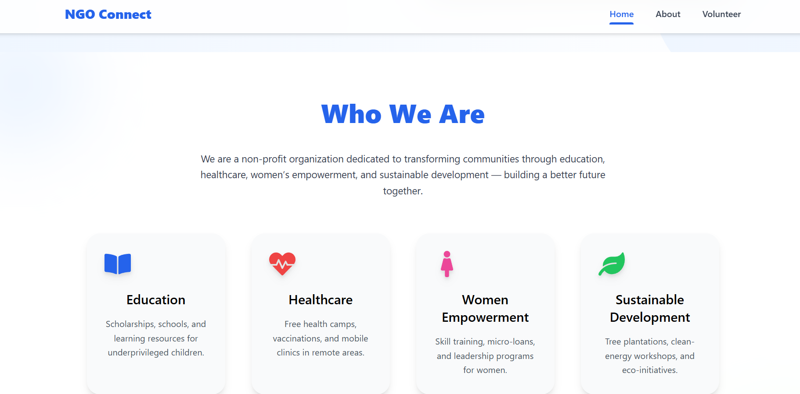
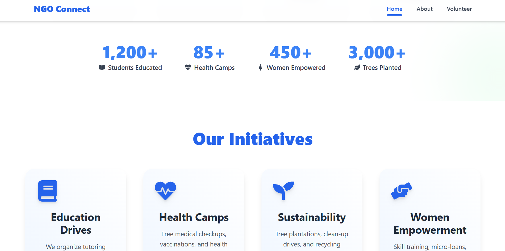
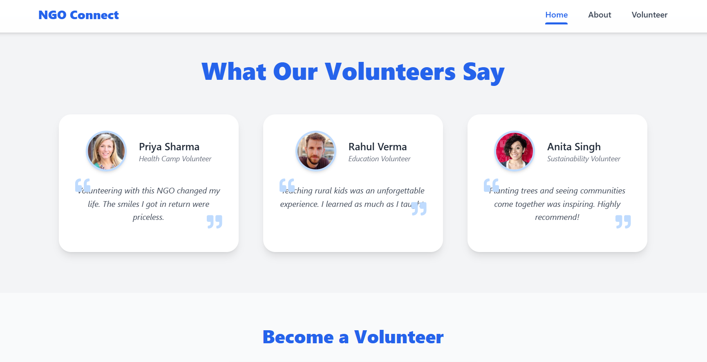
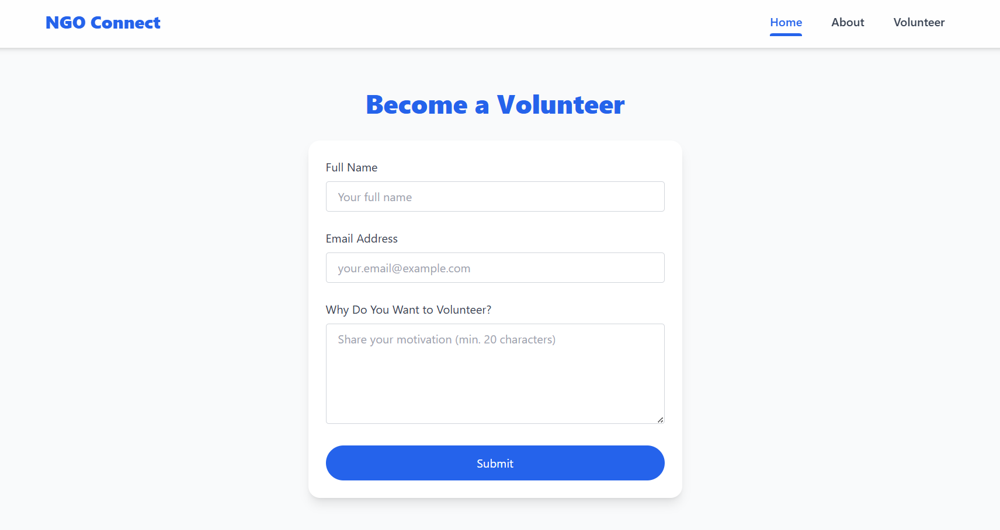

🌿 NGO Website – Built with React + Tailwind CSS

Hi! I'm Atharv Puranik, and this is a fully responsive NGO website I built as part of an internship selection process. The goal was to create a clean, modern, and functional site that reflects the mission of a non-profit organization — and I made sure to include everything from landing pages to forms, all coded from scratch using React and Tailwind CSS.

🚀 Project Overview

This website includes:

- ✅ A beautiful **Home page** with a clear intro to the NGO’s mission
- 📝 A working **Volunteer/Intern Registration Form** (front-end only)
- 📃 An **About Us** section to describe the vision and values
- 📱 **Mobile-first responsive design**
- 🎨 Clean and minimal Tailwind styling
- 💡 Structured for scalability and easy backend integration

I focused on clarity, usability, and a layout that recruiters or real users can actually visualize in production.

 📸 Preview

 Here’s a quick look at how it appears in the browser:
 
 
 
 
 

🛠️ Tech Stack
-------------------------------------------------------
| Tool/Library     | Purpose                          |
|------------------|----------------------------------|
| React            | UI Development (CRA setup)       |
| Tailwind CSS     | Styling and layout               |
| JavaScript (ES6) | Logic and interactions           |
| Git & GitHub     | Version control and hosting      |
-------------------------------------------------------

📂 Folder Structure

ngo-website/
├── public/
│ └── index.html
├── src/
│ ├── components/ # Reusable components like Navbar, Footer, etc.
│ ├── pages/ # Page-level components (Home, Register, About)
│ ├── App.js # Main app routing setup
│ ├── index.js # Entry point
│ └── index.css # Tailwind + global styles
├── package.json
└── README.md

 🧠 What I Learned

- Setting up and customizing Tailwind with Create React App
- Managing multiple page routes using React Router
- Designing clean, responsive UIs with utility-first CSS
- Organizing React code in a scalable, component-driven structure
- Debugging build errors with PostCSS and Tailwind integration

 🧪 How to Run the Project Locally

Clone the repo and run it in your local environment:

bash
git clone https://github.com/Atharv28ye/ngo-website12.git
cd ngo-website
npm install
npm start

✨ Future Improvements (If Given More Time)
🔐 Backend integration for form submissions (Node.js + MongoDB)

📥 File upload option in registration form
🌈 More animations or illustrations for storytelling
🔎 SEO & accessibility improvements

📫 Contact
Feel free to connect if you’d like to collaborate, review my code, or just say hi!

Name: Atharv Puranik
Email: puranikatharv@gmail.com
Mobile No- 9136114728
GitHub: @Atharv28ye
